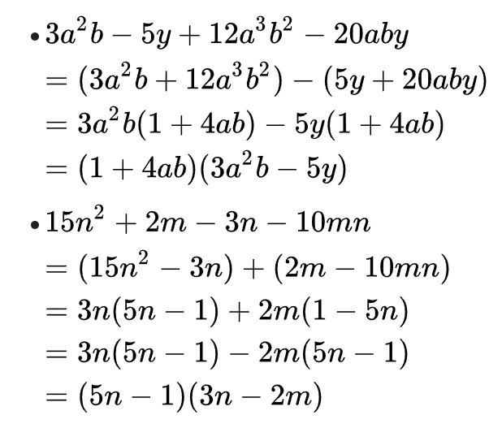

# 因式分解

## 因式分解的基本方法

#### 原则：

1. 分解必须要彻底（即分解后之因式均不能再做分解）
2. 结果最后只留下小括号
3. 结果的多项式首项为正。

***

### 提公因式法

这种方法是最简单的，如果看到多项式中有公因子，不管三七二十一，先提取一个公因子再说，因为这样整个问题就被简化了。

> 例题：\
> 因式分解下列多项式：\
> (1) $$x^3y-xy^3$$\
> (2) $$3x^3-18x^2+27x$$\
> (3) $$3a^3+6a^2b-3a^2c-6abc$$

### 公式法

因式分解是把一个多项式化为几个最简整式的乘积的形式，是整式乘积的逆运算，所以如果我们熟悉整式乘积的公式，那么解决因式分解也会很快。

常用的公式如下：

$$(a \pm b)^2=a^2 \pm 2ab+b^2$$

$$(a \pm b)^3=a^3 \pm 3a^2b +3ab^2 \pm b^3$$

$$a^2-b^2=(a+b)(a-b)$$

$$a^3 \pm b^3 = (a \pm b)(a^2 \mp ab + b^2)$$

$$(a+b+c)^2=a^2+b^2+c^2+2ab+2bc+2ca$$

$$a^3+b^3+c^3-3abc=(a+b+c)(a^2+b^2+c^2-ab-bc-ca)$$

$$a^n-b^n=(a-b)(a^{n-1}+a^{n-2}b+...+b^{n-1})$$

$$a^n+b^n=(a+b)(a^{n-1}-a^{n-2}b+a^{n-3}b^2-...+b^{n-1})$$ (n is odd)

> 例题：
>
> 因式分解： $$(a^2+b^2-1)^2-4a^2b^2$$

### 十字相乘法（双十字相乘法）

简单的十字相乘其实就是公式 $$x^2+(a+b)x+ab=(x+a)(x+b)$$ 的运用，有一句口诀：首尾分解，交叉相乘，求和凑中。

比十字相乘法再进一步的还有双十字相乘法，这种方法适用的是型如： $$ax^2+bxy+cy^2+dx+ey+f$$ 的多项式，方法的原理如下图

<figure><figcaption>
双十字相乘法示意图（来自百度百科）
</figcaption></figure>

利用双十字分解法的步骤就是：

1. 先用十字相乘法分解 $$ax^2+bxy+cy^2$$ ，得到 $$a_1,a_2,b_1,b_2$$
2. 把常数项 $$f$$ 进行拆分得到 $$f_1,f_2$$ ，使得 $$a_1f_2+a_2f_1=d, b_1f_2+b_2f_1=e$$
3. 最后得到 $$ax^2+bxy+cy^2+dx+ey+f=(a_1x+b_1y+f_1)(a_2x+b_2y+f_2)$$

> 例题：\
> 因式分解： $$2x^2-7xy-22y^2$$

### 待定系数法

待定系数法，肯定就是设未知数然后去解方程，比如分解如下多项式： $$x^3-4x^2+2x+1$$，是一个一元三次多项式，一般分解肯定是一个一次多项式乘以一个二次多项式，所以不妨设:

$$x^3-4x^2+2x+1=(x+a)(x^2+bx+c)$$

如果多项式相等，那么两个多项式每一项前对应的系数相等，所以所以我们就可以得到关于 a,b,c 的三个方程，接着求解出来就可以了。&#x20;

> 例题：\
> 因式分解： $$x^2+3xy+2y^2+4x+5y+3$$

### 分组分解法（拼拆添项）

分组分解一看这个名字就知道是要把多项式进行分组，然后提取出公因子，从而达到因式分解的目的。但是分组分解法有的时候没那么容易看出来，可能需要一点感觉。

#### 公式重组(拼)

透过公式重组，然后再抽出公约数，例子：

#### 添项法(增)

透过添项然后减掉，然后再抽出公约数，例子：

.png>)

#### 分项法(拆)

透过分裂某项，然后再抽出公约数，例子：

$$x^3-7x+6$$

### 求根法

求根法基于的就是[因式定理](polynomial-factorization.md#tuo-zhan-yin-shi-ding-li-yu-yu-shi-ding-li)

所以面对一个多项式，我们只要找到一个常数使得多项式为0，那么我们就能够通过长除法把原本的多项式次数降下来。

> 例题：\
> 因式分解： $$x^3-4x^2+6x-4$$ \
> 这里尝试发现 $$f(2)=0$$ ，所以必有一个因子 $$(x-2)$$ ，再根据长除法可知:\
> &#x20;$$x^3-4x^2+6x-4=(x-2)(x^2-2x+2)$$&#x20;

## 拓展：因式定理与余式定理

#### 余式定理

$$f(x)$$ 除以 $$x-a$$ 的余式为 $$f(a)$$ &#x20;

**证明：** $$F(x)=f(x) \cdot  g(x)+r(x)$$，其中$$f(x)$$ 为除式，$$r(x)$$ 为余式\
令 $$f(x)=x-a$$ ，由于余式的次数小于除式，$$r(x)$$ 为常数项 $$r$$ \
即 $$F(x)=(x-a) \cdot  g(x)+r$$，则 $$F(a)=r$$

#### 因式定理

若 $$f(a)=0$$，则 $$f(x)$$ 整除 $$x-a$$ ，则 $$x-a$$ 是 $$f(x)$$ 的一个因式

若 a 是一元多项式 $$f(x)$$ 的根，即 $$f(a) = 0$$ 成立，则多项式 $$f(x)$$ 有一个因式 $$x-a$$

## 练习

因式分解： $$(x^2+3x+2)(4x^2+8x+3)-90$$&#x20;

使用分组分解法因式分解：\
（1） $$x^3-4x^2+6x-4$$ \
（2） $$9x^4-3x^3+7x^2-3x-2$$&#x20;
